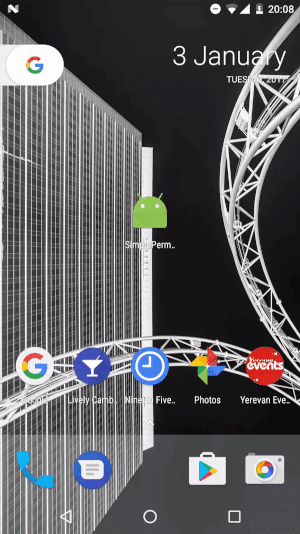

# SimplePermissions
[](https://android-arsenal.com/details/1/5009)
####This library allows you easily implement Android marshmallow permissions.
#
The list of [permisisons](https://github.com/armcha/SimplePermissions/blob/master/simplepermission/src/main/java/com/luseen/simplepermission/permissions/Permission.java), if I miss any permission please add and send me pull request.



## Download sample [apk][0]
[0]: https://github.com/armcha/SimplePermissions/raw/master/screen_and_apk/SimplePermissions.apk

## Download
```groovy
compile 'com.github.armcha:SimplePermissions:1.0.0'
```

## How to use
###Step 1. Extend your activity/fragment from PermissionActivity/PermissionFragment
```java
public class MyActivity extends PermissionActivity
```
or
```java
public class MyFragment extends PermissionFragment
```

###Step 2. 
#### Request single permission
```java
requestPermission(Permission.CAMERA, new SinglePermissionCallback() {
                @Override
                public void onPermissionResult(boolean permissionGranted, boolean isPermissionDeniedForever) {
                    if (permissionGranted) {
                        //Do your work
                    } else if (isPermissionDeniedForever) {
                        PermissionUtils.openApplicationSettings(context);
                    } else {
                        Toast.makeText(context, "Please grant permissions", Toast.LENGTH_SHORT).show();
                    }
                }
            });
```

#### Request multiple permissions
```java
Permission[] permissions = {Permission.CALL_PHONE, Permission.SEND_SMS, Permission.FINE_LOCATION};
requestPermissions(permissions, new MultiplePermissionCallback() {
            @Override
            public void onPermissionGranted(boolean allPermissionsGranted, List<Permission> grantedPermissions) {
                
            }

            @Override
            public void onPermissionDenied(List<Permission> deniedPermissions, List<Permission> foreverDeniedPermissions) {

            }
        });
```

## Permission utils
```java
PermissionUtils.openApplicationSettings(context);
```

```java
PermissionUtils.isMarshmallowOrHigher()
```


## Contact 

Pull requests are more than welcome.
Please fell free to contact me if there is any problem when using the library.

- **Email**: armcha01@gmail.com
- **Facebook**: https://web.facebook.com/chatikyana
- **Twitter**: https://twitter.com/ArmanChatikyan
- **Google +**: https://plus.google.com/112011638040018774140
- **Website**: http://luseen.com/

License
--------


      SimplePermissions library for Android
      Copyright (c) 2017 Arman Chatikyan (https://github.com/armcha/SimplePermissions).
      
      Licensed under the Apache License, Version 2.0 (the "License");
      you may not use this file except in compliance with the License.
      You may obtain a copy of the License at

         http://www.apache.org/licenses/LICENSE-2.0

      Unless required by applicable law or agreed to in writing, software
      distributed under the License is distributed on an "AS IS" BASIS,
      WITHOUT WARRANTIES OR CONDITIONS OF ANY KIND, either express or implied.
      See the License for the specific language governing permissions and
      limitations under the License.
    

